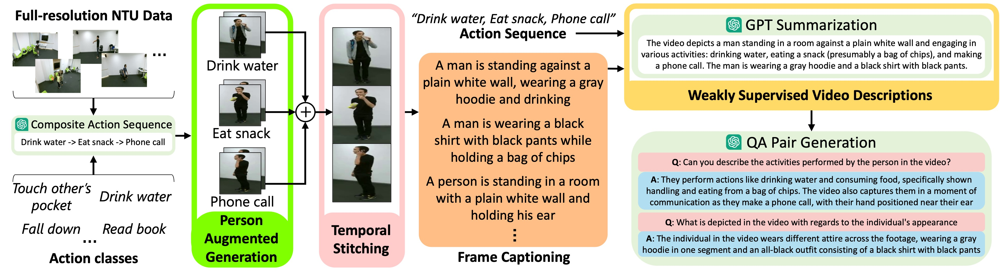

#  LLAVIDAL: Benchmarking Large LAnguage VIsion Models for Daily Activities of Living 🏃👩‍🦯‍➡️🗨️

<p align="center">
  
</p>   


-----
## Available resources
| **Resource**               | **Link**                                                                                                                                                                                            |
|----------------------------|-----------------------------------------------------------------------------------------------------------------------------------------------------------------------------------------------------|
| **Paper**                  | [](https://arxiv.org/pdf/2406.09390)                                                                                                      |
| **LLAVIDAL Weights**          | [](https://huggingface.co/datasets/dreilly/ADL-X/tree/main/model_weights)     |
| **(ADL-X) Multi-modal Features**         | [](https://huggingface.co/datasets/dreilly/ADL-X/tree/main/multimodal_features) |
| **(ADL-X) Instruction Dataset**    | [](https://huggingface.co/datasets/dreilly/ADL-X/tree/main/instruction_data) |
| **Data Curation**          | [](#data-curation-pipeline-) |
| **Training**               | [](#training-) |
| **Offline Demo**           | [](#running-demo-) |
| **Quantitative Evaluation**| [](#quantitative-evaluation-) |

---

## What is your goal?
<table>
    <thead><tr><th colspan=4><a href="#installation-wrench">Start with installation (click here)</a></th></tr></thead>
    <tbody><tr>
        <td><a href="#running-demo-">I want to try the demo</td>
        <td><a href="#training-">I want to train LLAVIDAL</td>
        <td><a href="#quantitative-evaluation-">I want to reproduce LLAVIDAL results</td>
        <td><a href="#adl-x-data-curation-pipeline-">I want to generate the ADL-X dataset</td>
    </tr></tbody>
</table>

---

## Installation :wrench:
Our python environement is identical to [Video-ChatGPT](https://github.com/mbzuai-oryx/Video-ChatGPT), we recommend following their installation instructions:

```shell
conda create --name=llavidal python=3.10
conda activate llavidal

git clone https://github.com/ADL-X/LLAVIDAL.git
cd LLAVIDAL
pip install -r requirements.txt

export PYTHONPATH="./:$PYTHONPATH"
```

Additionally, if you are using Ampere series or higher GPUs you can install [FlashAttention](https://github.com/HazyResearch/flash-attention),
```shell
pip install ninja

git clone https://github.com/HazyResearch/flash-attention.git
cd flash-attention
git checkout v1.0.7
python setup.py install
```
---

## Running Demo 🚗
We provide a Gradio demo to run LLAVIDAL on your local machine. For the best performance, use a CUDA-enabled machine with at least 18GB of VRAM.

1. Activate the llavidal Conda environment `conda activate llavidal`
2. Download the following LLaVA weights: [LLaVA-7B-Lightening-v1-1](https://huggingface.co/mmaaz60/LLaVA-7B-Lightening-v1-1)
3. Download the LLAVIDAL weights from [Available Resources](#available-resources)

Finally, run the demo by executing the following command:

```shell
python llavidal/demo/video_demo.py \
    --model-name <path to the LLaVA-7B-Lightening-v1-1 weights downloaded in step 2> \
    --projection_path <path to the downloaded llavidal weights (llavidal_weights.bin
) downloaded in step 3>
```

After running the command a URL will be provided. Click this URL and follow the on-screen instructions to use the demo.

---

## Quantitative Evaluation 🧪
Benchmarks in ADL-X consist of Action Recognition (AR), Temporal Completion (TC), and Video Description (Description) tasks. AR and TC tasks consist of multiple-choice questions, while Description tasks consist of open-ended questions
* **Action Recognition (AR) Benchmarks:** Smarthome-AR, Charades-AR
* **Temporal Completion (TC) Benchmarks:** LEMMA-TC, TSU-TC
* **Video Description (Description) Benchmarks:** Charades-Description, TSU-Description

We provide instructions for all benchmarks, as well as the required videos for Charades-AR, LEMMA-TC, and Charades-Description through [HuggingFace](https://huggingface.co/datasets/dreilly/ADL-X-Evals)
* For Smarthome-AR, the required videos can be requested though [their official webpage](https://project.inria.fr/toyotasmarthome/)
* For TSU, permission to publicize the required videos is **pending**

Steps to evaluate LLAVIDAL
1. Download the evaluation data from [HuggingFace](https://huggingface.co/datasets/dreilly/ADL-X-Evals)
2. Update the video directories and json instruction paths in `evaluation/ADL-X/run_evals.sh`
3. Download the base [LLaVA-7B-Lightening-v1-1](https://huggingface.co/mmaaz60/LLaVA-7B-Lightening-v1-1) weights, then update `BASE_LLAVA_PATH` in `evaluation/ADL-X/run_evals.sh`
Download the LLAVIDAL weights (`llavidal_weights.bin`) from [HuggingFace](https://huggingface.co/datasets/dreilly/ADL-X/tree/main/model_weights), then update `MODEL_PATHS` and `OUTPUT_NAMES` in `evaluation/ADL-X/run_evals.sh`
4. Run `bash evaluation/ADL-X/run_evals.sh`

---

## Training 💪🦾

LLAVIDAL is trained on ADL-X, an ADL dataset of over 100K video-instruction pairs. The weights of the model are initialized from LLaVA and it is trained for 3 epochs on 8 48GB NVIDIA RTX A6000 GPUs. To begin, download the LLaVA weights from this link: [LLaVA-7B-Lightening-v1-1](https://huggingface.co/mmaaz60/LLaVA-7B-Lightening-v1-1).

We provide two methods to prepare the ADL-X dataset for training:
1. **Download the pre-extracted RGB/Object/Skeleton features (recommended)**:
   - Download the multi-modal features (`video_features.zip`, `object_features.zip`, `pose_features.zip`) and Instruction Dataset (`NTU_QA-for-training.json`) from [Available Resources](#available-resources)
   - This should result in separate directories for each modality, and a json for training
2. **Curate the ADL-X RGB videos and generate RGB features, download Object/Skeleton**:
   - Follow the steps in [Data Curation Pipeline](#data-curation-pipeline-) to obtain the ADL-X videos. Extract features using any feature extractor (e.g., CLIP/SigLIP) 
   - Download the multi-modal Object/Skeleton features (`object_features.zip`, `pose_features.zip`)

### Standard training (this is not MMPro training proposed in the paper)
The command below will train the LLAVIDAL architecture for 3 epochs on all three modalities. This command is modular and will only train LLAVIDAL with the modalities whose folders are passed. For example, if only `--object_folder` and `--pose_folder` is passed, LLAVIDAL will drop the video modality and will only train with the object and pose modalities.
```shell
torchrun --nproc_per_node=8 --master_port 29001 llavidal/train/train_mem.py \
          --version v1 \
          --tune_mm_mlp_adapter True \
          --mm_use_vid_start_end \
          --bf16 True \
          --num_train_epochs 3 \
          --per_device_train_batch_size 4 \
          --per_device_eval_batch_size 4 \
          --gradient_accumulation_steps 1 \
          --evaluation_strategy "no" \
          --save_strategy "steps" \
          --save_steps 3000 \
          --save_total_limit 3 \
          --learning_rate 2e-5 \
          --weight_decay 0. \
          --warmup_ratio 0.03 \
          --lr_scheduler_type "cosine" \
          --logging_steps 100 \
          --tf32 True \
          --model_max_length 2048 \
          --gradient_checkpointing True \
          --lazy_preprocess True \
          --output_dir ./work_dirs/LLAVIDAL_video-object-pose-text_3epochs \
          --model_name_or_path /path/to/LLaVA-7B-Lightening-v-1-1/ \
          --data_path /path/to/NTU_QA-for-training.json \
          --video_folder /path/to/video_features/ \
          --object_folder /path/to/object_features/ /
          --pose_folder /path/to/pose_features/
```

### MMPro training
This is the suggested method to train LLAVIDAL, in which we use a curriculum learning approach to sequentially introduce modalities into LLAVIDAL. In the implementation this consists of training many models independently in stage 1, merging their weights, and propogating those weights to the next stage. The following command can be use to train LLAVIDAL with MMPro training (**UPDATE THE PATHS in mmpro_training.sh BEFORE RUNNING**):
```shell
bash scripts/mmpro_training.sh
```

The final model will be available in the directory you ran the above command at `./work_dirs/mmpose_training/stage3_video-pose-object-text/`.

---

## ADL-X Data Curation Pipeline 📖

<p align="center">
  
</p>   

**NOTE: You only need to follow the steps below if you want to generate the ADL-X RGB videos. If you are only interested in training LLAVIDAL, you can skip this process entirely and directly download the RGB/Object/Skeleton features of the ADL-X dataset in the [Available Resources](#available-resources) section above**. 

Follow the steps below to recreate ADL-X using the data curation pipeline proposed in the paper. You'll need to obtain access to and download the [NTU-RGB+D dataset](https://rose1.ntu.edu.sg/dataset/actionRecognition/). 

**1.** Be sure your NTU data directory is structured in the following way
```
NTU120
├── rgb
│   ├── S001C001P001R001A001_rgb.avi
│   ├── S001C001P001R001A002_rgb.avi
│   ...
├── skeletons
│   ├── S001C001P001R001A001.skeleton.npy
│   ├── S001C001P001R001A002.skeleton.npy
│   ...
```

**2.** Modify the paths in the following script and run it:
```shell
bash adlx_curation/gen_adlx_videos_and_QA.sh
```


**3.** Prepare Spatio-Temporal features using CLIP
For training efficiency, we pre-compute the spatio-temporal video features used during training. The following command will save one pickle file per video in directory specified by the `--clip_feat_path` argument. Run the following command to generate spatio-temporal features with CLIP:
 ```shell
 python scripts/save_spatio_temporal_clip_features.py \
        --video_dir_path /directory/to/save/stitched/videos/ \
        --clip_feat_path <The output dir where features should be saved>
```

**4.** Download the pre-computed pose (`pose_features.zip`) and object features (`object_features.zip`) from [Available Resources](#available-resources) and extract them

---

## ADL-X Dataset Details 📂

We are introducing ADLX the first ADL centric video instruction dataset, due to licensing restrictions we cannot share the original videos, but we share the [Video_features](https://huggingface.co/datasets/dreilly/ADL-X/blob/main/multimodal_features/object_features.zip) , [Pose Features](https://huggingface.co/datasets/dreilly/ADL-X/blob/main/multimodal_features/pose_features.zip) and [Object Features](https://huggingface.co/datasets/dreilly/ADL-X/blob/main/multimodal_features/object_features.zip)

The video features are structured as
```
Video Features
├── 001_video_001.pkl
├── 001_video_002.pkl
├── 001_video_003.pkl
├── 001_video_004.pkl
├── 001_video_005.pkl
├── 001_video_006.pkl
...

```
each video feature is of dimension 356 x 1024.

The pose features are structured as
```
Pose Features
├── 001_001_video_001_pose.pickle
├── 001_001_video_002_pose.pickle
├── 001_001_video_003_pose.pickle
├── 001_001_video_004_pose.pickle
├── 001_001_video_005_pose.pickle
├── 001_001_video_006_pose.pickle
├── 001_001_video_007_pose.pickle
├── 001_001_video_008_pose.pickle
...
```
each pose feature is of the dimension 216 x 256

The object features are structured as
```
Object Features
├── 001_001_video_001_object.pkl
├── 001_001_video_002_object.pkl
├── 001_001_video_003_object.pkl
├── 001_001_video_004_object.pkl
├── 001_001_video_005_object.pkl
├── 001_001_video_006_object.pkl
├── 001_001_video_007_object.pkl
├── 001_001_video_008_object.pkl
...
```
each object feature is of the dimension n x 8x 512, where n is the number of objects present in the video.

---

## Qualitative Analysis 🎬

<p align="center">
  
</p>  

---

## Acknowledgements 🙏
+ [Video-ChatGPT](https://github.com/mbzuai-oryx/Video-ChatGPT?tab=readme-ov-file)
+ [CogVLM](https://github.com/THUDM/CogVLM)

If you're using LLAVIDAL in your research or application, please consider citing it using the following BibTeX:
```bibtex
@inproceedings{llavidal2024,
  title={LLAVIDAL: A Large LAnguage VIsion Model for Daily Activities of Living}, 
  author={Dominick Reilly and Rajatsubhra Chakraborty and Arkaprava Sinha and Manish Kumar Govind and Pu Wang and Francois Bremond and Le Xue and Srijan Das},
    booktitle={Proceedings of the Conference on Computer Vision and Pattern Recognition (CVPR)},
    year={2025}
}
```
----------

## Usage LICENSE :

The dataset is protected under the CC-BY license of Creative Commons, which allows users to distribute, remix, adapt, and build upon the material in any medium or format, as long as the creator is attributed. The license allows ADL-X for commercial use. As the authors of this manuscript and collectors of this dataset, we reserve the right to distribute the data.

------
